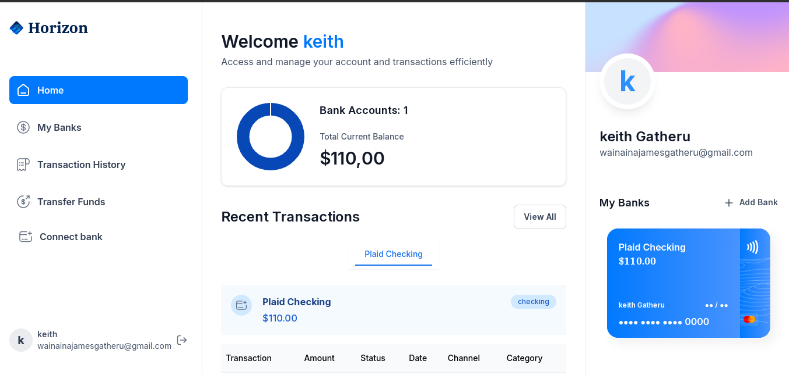

# Horizon




Horizon is a modern web application built with [Next.js](https://nextjs.org/), designed to provide a seamless user experience with high performance and scalability in mind. This project leverages Next.js features like server-side rendering (SSR), static site generation (SSG), and API routes to create a robust web platform.

## Features

- **Fast Development**: Built using Next.js with automatic code-splitting and server-side rendering.
- **Customizable UI**: Fully customizable components to adapt to various design needs.
- **Optimized Fonts**: Uses `next/font` to automatically optimize and load custom fonts like Google Fonts.
- **Scalable Architecture**: Designed to scale from small projects to large enterprise solutions.

## Getting Started

### Prerequisites

Ensure you have **Node.js** and **npm** (or **yarn**, **pnpm**, or **bun**) installed on your machine.

### Running the Development Server

To get started with the **Horizon** project:

1. **Clone the project**:

   ```bash
   git clone https://github.com/your-username/horizon.git
2. **Cd into the project**;
3. **Install dependencies**;
npm run dev,  
 or
  yarn dev
or
 ppm dev
or
 bun dev


